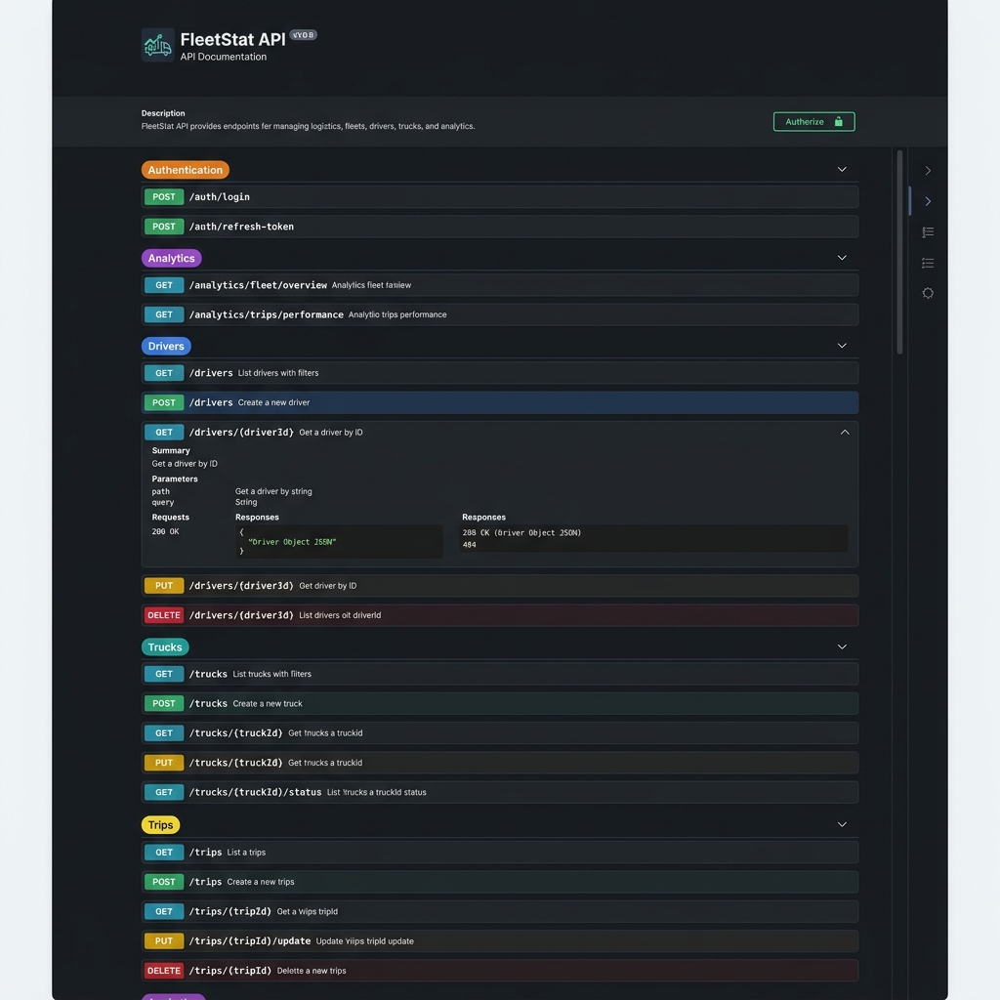
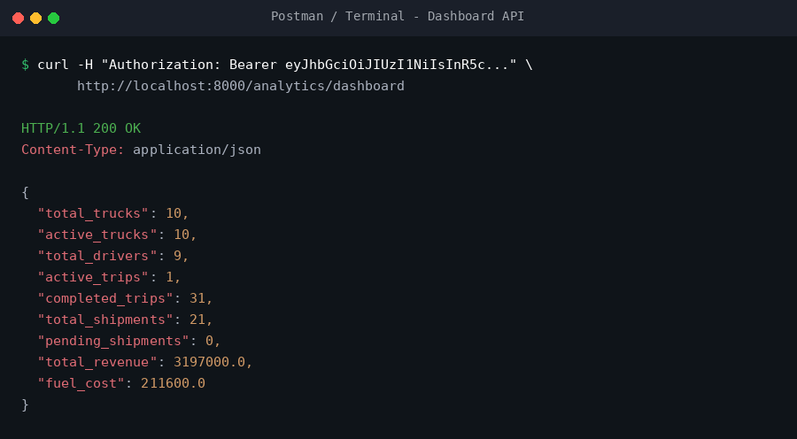
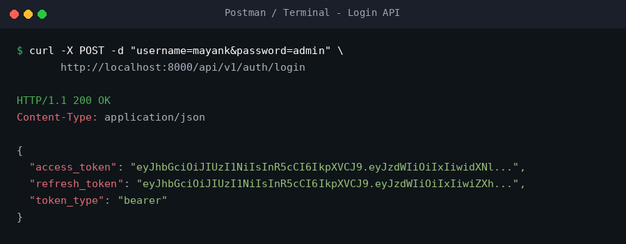
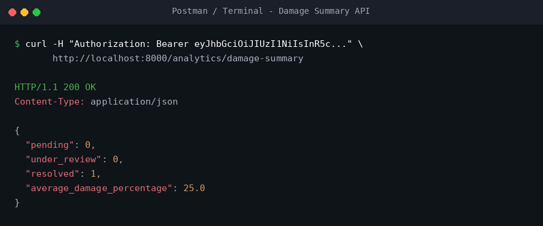
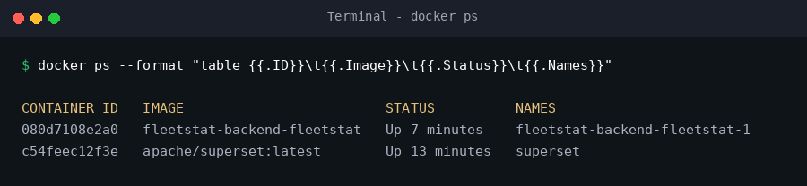

# FleetStat

FleetStat is a logistics and fleet management backend built using FastAPI and PostgreSQL. The system helps administrators manage drivers, trucks, trips, shipments, fuel logs, payments, damage reports, and analytics through secure role-based APIs.

## Features


## Project Highlights

- Designed a logistics and fleet management backend from scratch
- Implemented JWT Authentication with Role-Based Access Control (RBAC)
- Secured APIs using resource ownership validation
- Built 50+ RESTful API endpoints
- Integrated PostgreSQL with SQLAlchemy
- Added analytics and business reporting APIs
- Dockerized the complete backend application

## API Modules

- Authentication
- Users
- Drivers
- Trucks
- Trips
- Shipments
- Containers
- Trip Assignments
- Container Assignments
- Fuel Logs
- Payments
- Damage Reports
- Analytics

## Project Metrics

- 13+ Database Tables
- 50+ REST APIs
- JWT Authentication
- Role-Based Access Control
- Dockerized Deployment


## Database

PostgreSQL is used as the primary relational database.

Core entities:

- Users
- Drivers
- Trucks
- Trips
- Shipments
- Containers
- Payments
- Fuel Logs
- Damage Reports

### Authentication & Security

* JWT Authentication
* Role-Based Access Control (Admin / Driver)
* Ownership Validation
* Protected Endpoints

### Fleet Management

* Driver Management
* Truck Management
* Trip Management
* Shipment Management
* Container Management

### Operations

* Fuel Log Tracking
* Damage Reporting
* Payment Tracking
* Driver Assignments

### Analytics

* Dashboard Statistics
* Revenue Analytics
* Driver Performance Analytics
* Damage Summary Analytics

### Deployment

* Dockerized Backend
* PostgreSQL Database

---

## Tech Stack

### Backend

* FastAPI
* SQLAlchemy
* PostgreSQL
* JWT Authentication
* Pydantic

### DevOps

* Docker

---

## Project Structure

```text
fleetstat-backend/
├── app/
│   ├── routers/
│   ├── auth.py
│   ├── database.py
│   ├── dependencies.py
│   ├── schemas.py
│   └── main.py
├── Dockerfile
├── requirements.txt
└── .env
```

---

## API Documentation

* **Swagger UI:** [http://localhost:8000/docs](http://localhost:8000/docs)
* **OpenAPI JSON:** [http://localhost:8000/openapi.json](http://localhost:8000/openapi.json)

---

## Running Locally

1. **Clone repository**
   ```bash
   git clone <repository-url>
   ```

2. **Install dependencies**
   ```bash
   pip install -r requirements.txt
   ```

3. **Configure `.env`**
   Create a `.env` file in the `fleetstat-backend` directory with the following variables:
   ```env
   SECRET_KEY=your_secret
   ALGORITHM=HS256
   ACCESS_TOKEN_EXPIRE_MINUTES=60
   DB_HOST=localhost
   DB_PORT=5432
   DB_NAME=fleetstat
   DB_USER=postgres
   DB_PASSWORD=your_password
   ```

4. **Run application**
   ```bash
   uvicorn app.main:app --reload
   ```

---

## Docker Setup

* **Build image:**
  ```bash
  docker build -t fleetstat-backend .
  ```

* **Run container:**
  ```bash
  docker run -d \
    --name fleetstat-api \
    -p 8000:8000 \
    --env-file .env \
    fleetstat-backend
  ```

---

## Current Status

* **Backend Development:** Completed
* **Authentication & RBAC:** Completed
* **Analytics Dashboard APIs:** Completed
* **Dockerization:** Completed
* **Frontend Development:** In Progress

---

## Future Enhancements

* React Frontend
* Cloud Deployment
* Automated Testing
* Damage Photo Uploads
* Email Notifications
* Advanced Analytics

---

## Screenshots

### Swagger API Documentation (`/docs` Swagger page)


### Analytics Dashboard API
Backend analytics endpoints powering the future React dashboard.


### Admin Login Response


### Analytics Dashboard API Response


### Damage Summary API Response


### Docker Running Status (`docker ps`)

